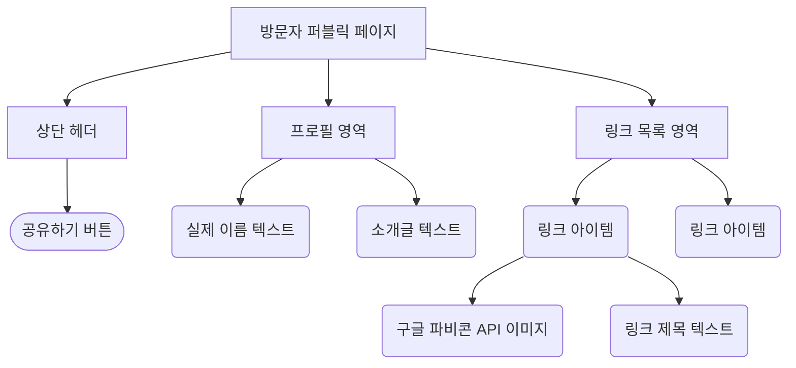
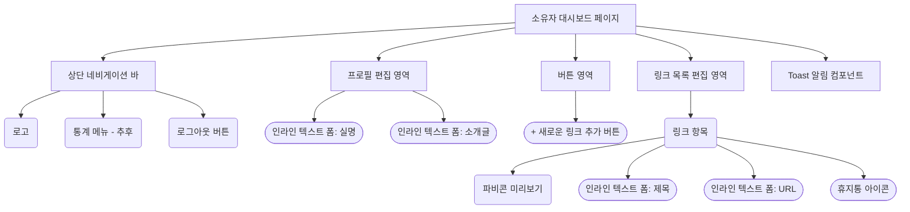

# 와이어프레임 (Wireframe) - 마이링크(MyLink)

마이링크 서비스의 주요 두 화면(방문자 퍼블릭 페이지, 소유자 대시보드)에 대한 와이어프레임입니다. PC에서도 모바일 비율(가운데 정렬)로 렌더링되며, 직관적인 인터페이스를 제공합니다.

---

## 1. 방문자 퍼블릭 페이지 (Visitor View)

이 화면은 사용자의 URL(`mylink.com/닉네임`)로 접속했을 때 방문자가 보게 되는 화면입니다. 

### 📱 화면 설계 (ASCII Art)

```text
       [ PC / Mobile 화면 중앙 고정 비율 영역 ]
+-------------------------------------------------+
|                                           [공유]| <-- 우측 상단 공유하기 아이콘
|                                                 |
|                   username                      | <-- 실제 이름(실명) 노출
|         "안녕하세요. 프론트엔드 개발자입니다."        | <-- 한줄 소개글 (Bio)
|                                                 |
|  +-------------------------------------------+  |
|  | [f]  나의 깃허브                            |  | <-- 파비콘 아이콘 + 제목 (클릭 시 이동)
|  +-------------------------------------------+  |
|                                                 |
|  +-------------------------------------------+  |
|  | [f]  기술 블로그                            |  |
|  +-------------------------------------------+  |
|                                                 |
|  +-------------------------------------------+  |
|  | [f]  인스타그램                             |  |
|  +-------------------------------------------+  |
|                                                 |
|                                                 |
|                  Powered by MyLink              |
+-------------------------------------------------+
```

### 🧩 화면 컴포넌트 구조도 (Mermaid)



---

## 2. 소유자 관리 대시보드 (Owner Dashboard View)

소유자가 구글 로그인 후 접속하는 관리 화면입니다. 인라인 편집(Inline Edit)을 통해 직관적으로 수정할 수 있습니다.

### 📱 화면 설계 (ASCII Art)

```text
       [ PC / Mobile 화면 중앙 고정 비율 영역 ]
+-------------------------------------------------+
| MyLink 로고                  [통계]  [로그아웃]   | <-- 상단 GNB 네비게이션
+-------------------------------------------------+
|                                                 |
|                [✏️ username]                    | <-- 텍스트 클릭 시 즉시 인라인 수정
|         [✏️ 짧은 소개글을 입력하세요...]             | <-- 텍스트 클릭 시 즉시 인라인 수정
|                                                 |
|  +-------------------------------------------+  |
|  |              ➕ 새로운 링크 추가              |  | <-- 버튼 클릭 시 아래 목록 상단에 빈 칸 추가
|  +-------------------------------------------+  |
|                                                 |
|  [f]  [✏️ 제목: 나의 깃허브                 ] [🗑️]| <-- 제목 인라인 편집 & 삭제 버튼
|       [✏️ URL: https://github.com/...      ]     | <-- URL 인라인 편집 (Enter 저장)
|  ---------------------------------------------  |
|  [f]  [✏️ 제목: 기술 블로그                 ] [🗑️]|
|       [✏️ URL: https://velog.io/...        ]     |
|                                                 |
|                                [알림: 저장됨]     | <-- 작업 완료 시 토스트 알림 노출
+-------------------------------------------------+
```

### 🧩 화면 컴포넌트 구조도 (Mermaid)



---

## 💡 주요 UI/UX 포인트 요약
1. **모바일 뷰어 중심**: PC 접속 시에도 컨텐츠 영역은 모바일 비율(예: max-width: 480px)로 가운데 정렬되어, 소유자가 편집하는 화면과 방문자가 보는 화면의 괴리를 없앱니다.
2. **최소한의 뎁스(Depth)**: 모달 창이나 새로운 페이지 이동을 최소화하고, 모든 수정 작업을 메인 대시보드 내 **인라인 텍스트 클릭 및 `Enter` 키**를 통해 처리합니다.
3. **직관적인 아이콘**: 각 링크 좌측에 구글 파비콘 API를 렌더링하여 별도의 이미지 업로드 없이도 시각적인 만족감을 줍니다.
